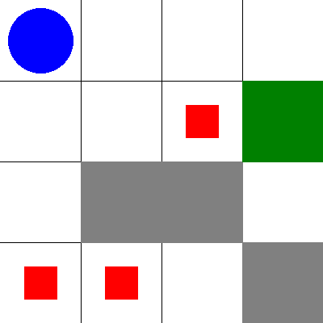

# Rescue drone task #
## Abstract ##
The report focuses on the design and implementation of a rescue drone planning system for navigating disaster sites using a grid-based environment. It includes the testing of the planner on various grid configurations and an analysis of the efficiency of the solutions generated, considering factors like search space, operator applicability, and performance across different test cases. The goal is to evaluate whether the planner can consistently generate effective and optimal rescue plans.

# Drone Rescue Mission: Problem and Domain Description

## Static Domain File Overview: `rescue-drone-static_domain.pddl`

This file defines the **static rules** and capabilities of the environment, including:

- **Types:**
  - `location`, `person`, `drone`, `capacity`.

- **Predicates:**
  - `(Drone-location ?d ?loc)`: The drone is at a specific location.
  - `(Person-location ?p ?loc)`: A person is located at a specific location.
  - `(Drone-free)`: The drone is available to pick up someone.
  - `(Rescued ?p)`: A person has been rescued.
  - `(Safe-zone-has-capacity ?loc ?c)`: A safe zone has remaining capacity for rescue.
  - `(Adjacent ?loc1 ?loc2)`: Two locations are adjacent.

- **Actions:**
  - **Move**: The drone can move between adjacent locations if there are no obstacles.
  - **Pick-up**: The drone can pick up a person if they are in the same location, provided the drone is free.
  - **Drop-off**: The drone can drop off a person at a safe zone, provided the zone has capacity.

---

## Dynamic Domain File Overview: `rescue-drone-dynamic_domain.pddl`

This file extends the static domain with the action `Increase-Capacity`, allowing the drone to reset the predicate `Safe-zone-has-capacity`

---

## Problem File Overview: `5x5_grid_dynamic_capacity_problem.pddl`

The problem file defines the specific instance of the rescue mission. Here are its key elements:

- **Objects:**
  - Locations: 25 locations are defined (`loc-1-1`, `loc-1-2`, etc.) representing the cells of the grid.
  - One drone: `drone1`.
  - Four persons to be rescued: `person1`, `person2`, `person3`, `person4`.
  - Capacity for safe zones: `capacity1`, `capacity2`.

- **Initial Conditions:**
  - The grid is defined by setting adjacent locations. For example, `(adjacent loc-1-1 loc-1-2)` defines that these two locations are connected.
  - The drone starts in one specific location.
  - Each person is placed in a different location.
  - Safe zones have capacity, which is essential for rescuing people.

- **Goal:**
  The goal is to move the drone to rescue all the people by picking them up from their initial locations and dropping them off at designated safe zones.

---

## Visualizing the Initial State

To better understand the environment, an image can be created showing the 5x5 grid with the starting positions of the drone and the people. The grid layout would highlight the initial positions of each entity.

