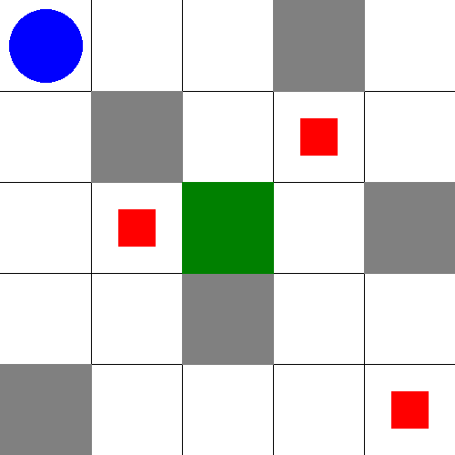
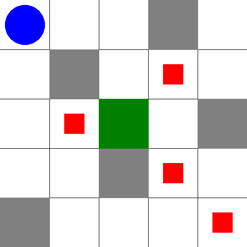
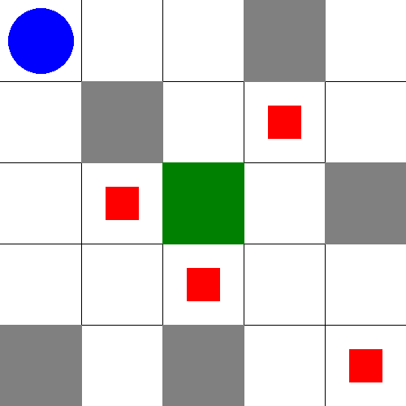

# Rescue drone task 
## Abstract 
The report focuses on the design and implementation of a rescue drone planning system for navigating disaster sites using a grid-based environment. It includes the testing of the planner on various grid configurations and an analysis of the efficiency of the solutions generated, considering factors like search space, operator applicability, and performance across different test cases. The goal is to evaluate whether the planner can consistently generate effective and optimal rescue plans.

## Analysis of the problem

### Static Domain File Overview: `rescue-drone-static_domain.pddl`

This file defines the **static rules** and capabilities of the environment, including:

- **Types:**
  - `location`, `person`, `drone`, `capacity`.

- **Predicates:**
  - `(Drone-location ?d ?loc)`: The drone is at a specific location.
  - `(Person-location ?p ?loc)`: A person is located at a specific location.
  - `(Drone-free)`: The drone is available to pick up someone.
  - `(Rescued ?p)`: A person has been rescued.
  - `(Safe-zone-has-capacity ?loc ?c)`: A safe zone has remaining capacity for rescue.
  - `(Adjacent ?loc1 ?loc2)`: Two locations are adjacent.

- **Actions:**
  - **Move**: The drone can move between adjacent locations if there are no obstacles.
  - **Pick-up**: The drone can pick up a person if they are in the same location, provided the drone is free.
  - **Drop-off**: The drone can drop off a person at a safe zone, provided the zone has capacity.

---

### Dynamic Domain File Overview: `rescue-drone-dynamic_domain.pddl`

This file extends the static domain with the action `Increase-Capacity`, allowing the drone to reset the predicate `Safe-zone-has-capacity`

---

### Problem File Overview: Case 1. `4x4_grid_solvable_problem.pddl`
- **Objects:**
  - **Locations:** 
    - 16 locations are defined in the 4x4 grid: `loc-1-1`, `loc-1-2`, `loc-1-3`, `loc-1-4`, `loc-2-1`, `loc-2-2`, `loc-2-3`, `loc-2-4`, `loc-3-1`, `loc-3-2`, `loc-3-3`, `loc-3-4`, `loc-4-1`, `loc-4-2`, `loc-4-3`, `loc-4-4`.
  - **Drone:**
    - One drone is defined: `drone1`.
  - **Three persons to be rescued:**
    - `person1`, `person2`, `person3`.
  - **Capacities for safe zones:**
    - Three capacity objects: `c1`, `c2`, `c3`. These likely represent the capacity limits of safe zones where rescued persons will be dropped off.

- **Initial Conditions:**
  - **Grid definition through adjacency:**
    - The grid is defined using adjacency relations between the locations in a 4x4 configuration. For example, `(adjacent loc-1-1 loc-1-2)` means that `loc-1-1` is adjacent to `loc-1-2`, and similar relations exist to define both horizontal and vertical adjacencies.
  - **Drone Location:**
    - The drone starts at a specific location within the grid, though the exact initial position is not fully visible from the provided content.
  - **Person Locations:**
    - Each person (`person1`, `person2`, `person3`) is placed in different, distinct locations within the grid.
  - **Safe Zones:**
    - The capacities defined as `c1`, `c2`, `c3` indicate safe zones where the persons need to be delivered once rescued by the drone. Each safe zone has a capacity constraint that must be considered during the mission.

- **Goal:**
  - The goal for all the problems is to have all persons with the rescue state set to true (all of them dropped-off on the safe zone)
---

### Problem File Overview: Case 2. `5x5_grid_solvable_problem.pddl`
- **Objects:**
  - Locations: 25 locations are defined (`loc-1-1`, `loc-1-2`, etc.) representing the cells of the grid.
  - One drone: `drone1`.
  - Four persons to be rescued: `person1`, `person2`, `person3`, `person4`.
  - Four capacities: `capacity1`, `capacity2`, `capacity3`, `capacity4`.

- **Initial Conditions:**
  - The grid is defined by setting adjacent locations. For example, `(adjacent loc-1-1 loc-1-2)` defines that these two locations are connected.
  - The drone starts in one specific location.
  - Each person is placed in a different location.
  - Safe zones have capacity, which is essential for rescuing people.

---

### Problem File Overview: Case 3. `5x5_grid_unsolvable_problem.pddl`
- **Objects:**
  - Locations: 25 locations are defined (`loc-1-1`, `loc-1-2`, etc.) representing the cells of the grid.
  - One drone: `drone1`.
  - Four persons to be rescued: `person1`, `person2`, `person3`, `person4`.
  - 2 safe zone capacities (note that is less than the number of people): `capacity1`, `capacity2`.

- **Initial Conditions:**
  - The grid is defined by setting adjacent locations. For example, `(adjacent loc-1-1 loc-1-2)` defines that these two locations are connected.
  - The drone starts in one specific location.
  - Each person is placed in a different location.
  - Safe zones have capacity, which is essential for rescuing people.

---

### Problem File Overview: Case 4. `5x5_grid_dynamic_capacity_problem.pddl`

This problem is identic to the `5x5_grid_unsolvable_problem.ppdl` with the difference of the domain, this one uses the `lab2/rescue-drone-dynamic_domain.pddl` which includes the action `Increase-Capacity`.

---

## Testing cases and results

To better understand the environment, an image is displayed with the starting positions of the drone and the people for each of the studied cases. In all of the scenarios the drone is represented as a blue circle, the people as red squares, the obstacles as gray squares and the safe zone in green.

### Case 1: 4x4 grid, solvable problem and static domain

### Case 2: 5x5 grid, solvable problem and static domain

### Case 3: 5x5 grid, unsolvable problem and static domain

### Case 3: 5x5 grid, solvable problem and dynamic capacity domain

## Analysis of the results

The search strategy used in this planning task is A* (A-star) with the **merge-and-shrink heuristic**. The heuristic incorporates an exact **bisimulation shrink strategy**, which reduces the size of the state space while preserving relevant transitions. For merging, a **precomputed merge tree** is used, guided by the **miasm_merge_and_shrink** approach. This includes heuristic scoring functions like **goal relevance**, **DFP** (Diverse Frontier Projection), and **total order**, ensuring an efficient search. To further optimize, **structural symmetries** are handled through OSS, reducing redundancy, and **stubborn sets simple** pruning is applied to eliminate unnecessary expansions, improving search performance.

Moreover, in the provided plan for each scenario, several key performance parameters were analyzed, including generated nodes, expanded nodes, and total time used, as it can be seen in Table 1. The generated nodes represent the total number of states created during the search process, while the expanded nodes refer to the subset of those states that were fully explored, with all their possible actions evaluated. These metrics, along with the total time taken by the planner, provide insight into the efficiency and complexity of the search process in each case.

From these results, it can be concluded that the efficiency of the planner (in terms of time) does not solely depend on the number of generated or expanded nodes. External factors, such as the complexity of the problem and the specific structure of the state space, likely contribute to the observed differences.

| Problem & Planner               | 4x4_solvable (Delfi) | 4x4_solvable (BWFS) | 5x5_solvable (Delfi) | 5x5_solvable (BWFS) | 5x5_unsolvable (Delfi) | 5x5_dyn_capacity (Delfi) | 5x5_dyn_capacity (BWFS) |
|----------------------------------|----------------------|---------------------|----------------------|---------------------|------------------------|--------------------------|-------------------------|
| **Plan length**                  | 28 steps             | 32 steps            | 22 steps             | 22 steps            | N/A                    | 28 steps                 | 28 steps                |
| **Plan cost**                    | 28                   | 32                  | 22                   | 22                  | N/A                    | 28                       | 28                      |
| **Expanded states**              | 29                   | 95                  | 23                   | 128                 | N/A                    | 29                       | 1370                    |
| **Reopened states**              | 0                    | N/A                 | 0                    | N/A                 | N/A                    | 0                        | N/A                     |
| **Evaluated states**             | 60                   | N/A                 | 62                   | N/A                 | N/A                    | 73                       | N/A                     |
| **Generated states**             | 84                   | 149                 | 85                   | 233                 | N/A                    | 101                      | 1656                    |
| **Search time**                  | 0.00077 s            | 0.00045 s           | 0.00086 s            | 0.00047 s           | N/A                    | 0.00105 s                | 0.01657 s               |
| **Total time**                   | 0.0865 s             | 0.00045 s           | 0.00578 s            | 0.00278 s           | N/A                    | 0.2131 s                 | 0.01657 s               |
| **Peak memory**                  | 22,476 KB            | N/A                 | 5,656 KB             | N/A                 | N/A                    | 58,348 KB                | N/A                     |
| **Makespan**                     | 0.0270 s             | 0.0310 s            | 0.0210 s             | 0.0210 s            | N/A                    | 0.0270 s                 | 0.0270 s                |
| **Search duration**              | 8.28 s               | 3.43 s              | 8.61 s               | 2.78 s              | 7.10 s                 | 9.00 s                   | 2.77 s                  |
| **Plans found**                  | 1                    | 1                   | 1                    | 1                   | 0                      | 1                        | 1                       |
