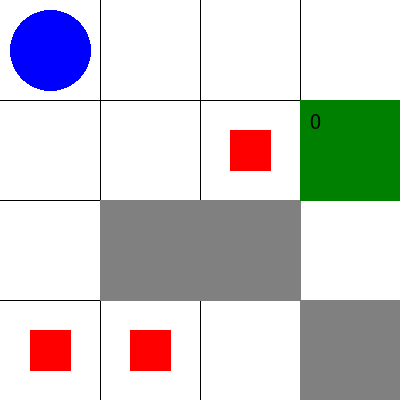

# Rescue drone task 

Authors:
- Antonio Lobo Santos
- María del Carmen Ramírez Trujillo
- Pedro Agúndez

MAI students

## Abstract 
The report focuses on the design and implementation of a rescue drone planning system for navigating disaster sites using a grid-based environment. It includes the testing of the planner on various grid configurations and an analysis of the efficiency of the solutions generated, considering factors like search space, operator applicability, and performance across different test cases. The goal is to evaluate whether the planner can consistently generate effective and optimal rescue plans.

## Analysis of the problem

For solving the problem we will use as inspiration the two labs that we have done in with the professor: 
- 8-Puzzle Game

We designed a theoretically feasible approach:
1. We first need to define all the positions on the grid and declare adjancent those we can move between.
2. We should define types for all the objects and predicates to locate them in the grid. Also for identifying special locations as obstacles and the safe zone.
3. We should implement actions for the drone for being able to **move**, **pick-up** a person and **drop-off** a person at the safe zone.
4. We should take into account that the drone can't move to positions that have obstacles.
5. As we don't need an order we don't need to use an ordered number set for modeling capacity. Instead of this, we will use predicates that represents units (capacities) and we will negate them when used. But we don't mind if one capacity object is used before another as it is only important is to respect the maximum capacity of the safe zone.


Now we proceed with the implementation in pddl.

### Static Domain File Overview: `rescue-drone-static_domain.pddl`

This file defines the **static rules** and capabilities of the environment, including:

- **Types:**
  - `location`, `person`, `drone`, `capacity`.

- **Predicates:**
  - `(Drone-location ?d ?loc)`: The drone is at a specific location.
  - `(Person-location ?p ?loc)`: A person is located at a specific location.
  - `(Drone-free)`: The drone is available to pick up someone.
  - `(Rescued ?p)`: A person has been rescued.
  - `(Safe-zone-has-capacity ?loc ?c)`: A safe zone has remaining capacity for rescue.
  - `(Adjacent ?loc1 ?loc2)`: Two locations are adjacent.

- **Actions:**
  - **Move**: The drone can move between adjacent locations if there are no obstacles.
  - **Pick-up**: The drone can pick up a person if they are in the same location, provided the drone is free.
  - **Drop-off**: The drone can drop off a person at a safe zone, provided the zone has capacity.

---

### Dynamic Domain File Overview: `rescue-drone-dynamic_domain.pddl`

This file extends the static domain with the action `Increase-Capacity`, allowing the drone to reset the predicate `Safe-zone-has-capacity`
This assumes that randomly in any moment a person can leave the safe zone and leave a free spot in it

---

### Problem File Overview: Case 1. `4x4_grid_solvable_problem.pddl`
- **Objects:**
  - **Locations:** 
    - 16 locations are defined in the 4x4 grid: `loc-1-1`, `loc-1-2`, `loc-1-3`, `loc-1-4`, `loc-2-1`, `loc-2-2`, `loc-2-3`, `loc-2-4`, `loc-3-1`, `loc-3-2`, `loc-3-3`, `loc-3-4`, `loc-4-1`, `loc-4-2`, `loc-4-3`, `loc-4-4`.
  - **Drone:**
    - One drone is defined: `drone1`.
  - **Three persons to be rescued:**
    - `person1`, `person2`, `person3`.
  - **Capacities for safe zones:**
    - Three capacity objects: `c1`, `c2`, `c3`. These likely represent the capacity limits of safe zones where rescued persons will be dropped off.

- **Initial Conditions:**
  - **Grid definition through adjacency:**
    - The grid is defined using adjacency relations between the locations in a 4x4 configuration. For example, `(adjacent loc-1-1 loc-1-2)` means that `loc-1-1` is adjacent to `loc-1-2`, and similar relations exist to define both horizontal and vertical adjacencies.
  - **Drone Location:**
    - The drone starts at a specific location within the grid, though the exact initial position is not fully visible from the provided content.
  - **Person Locations:**
    - Each person (`person1`, `person2`, `person3`) is placed in different, distinct locations within the grid.
  - **Safe Zones:**
    - The capacities defined as `c1`, `c2`, `c3` indicate safe zones where the persons need to be delivered once rescued by the drone. Each safe zone has a capacity constraint that must be considered during the mission.

- **Goal:**
  - The goal for all the problems is to have all persons with the rescue state set to true (all of them dropped-off on the safe zone)
---

### Problem File Overview: Case 2. `5x5_grid_solvable_problem.pddl`
- **Objects:**
  - Locations: 25 locations are defined (`loc-1-1`, `loc-1-2`, etc.) representing the cells of the grid.
  - One drone: `drone1`.
  - Four persons to be rescued: `person1`, `person2`, `person3`, `person4`.
  - Four capacities: `capacity1`, `capacity2`, `capacity3`, `capacity4`.

- **Initial Conditions:**
  - The grid is defined by setting adjacent locations. For example, `(adjacent loc-1-1 loc-1-2)` defines that these two locations are connected.
  - The drone starts in one specific location.
  - Each person is placed in a different location.
  - Safe zones have capacity, which is essential for rescuing people.

---

### Problem File Overview: Case 3. `5x5_grid_unsolvable_problem.pddl`
- **Objects:**
  - Locations: 25 locations are defined (`loc-1-1`, `loc-1-2`, etc.) representing the cells of the grid.
  - One drone: `drone1`.
  - Four persons to be rescued: `person1`, `person2`, `person3`, `person4`.
  - 2 safe zone capacities (note that is less than the number of people): `capacity1`, `capacity2`.

- **Initial Conditions:**
  - The grid is defined by setting adjacent locations. For example, `(adjacent loc-1-1 loc-1-2)` defines that these two locations are connected.
  - The drone starts in one specific location.
  - Each person is placed in a different location.
  - Safe zones have capacity, which is essential for rescuing people.

---

### Problem File Overview: Case 4. `5x5_grid_dynamic_capacity_problem.pddl`

This problem is identic to the `5x5_grid_unsolvable_problem.ppdl` with the difference of the domain, this one uses the `lab2/rescue-drone-dynamic_domain.pddl` which includes the action `Increase-Capacity`.

---

## Testing cases and results

To better understand the environment, an image is displayed with the starting positions of the drone and the people for each of the studied cases. In all of the scenarios the drone is represented as a blue circle, the people as red squares, the obstacles as gray squares and the safe zone in green.

### Case 1: 4x4 grid, solvable problem and static domain


### Case 2: 5x5 grid, solvable problem and static domain


### Case 3: 5x5 grid, unsolvable problem and static domain


### Case 3: 5x5 grid, solvable problem and dynamic capacity domain


## Analysis of the results

The search strategy used in this planning task is A* (A-star) with the **merge-and-shrink heuristic**. The heuristic incorporates an exact **bisimulation shrink strategy**, which reduces the size of the state space while preserving relevant transitions. For merging, a **precomputed merge tree** is used, guided by the **miasm_merge_and_shrink** approach. This includes heuristic scoring functions like **goal relevance**, **DFP** (Diverse Frontier Projection), and **total order**, ensuring an efficient search. To further optimize, **structural symmetries** are handled through OSS, reducing redundancy, and **stubborn sets simple** pruning is applied to eliminate unnecessary expansions, improving search performance.

Moreover, in the provided plan for each scenario, several key performance parameters were analyzed, including generated nodes, expanded nodes, and total time used, as seen in Table 1. The generated nodes represent the total number of states created during the search process, while the expanded nodes refer to the subset of those states that were fully explored, with all their possible actions evaluated. These metrics, along with the total time taken by the planner, provide insight into the efficiency and complexity of the search process in each case.

From these results, it can be concluded that the efficiency of the planner (in terms of time) does not solely depend on the number of generated or expanded nodes. External factors, such as the complexity of the problem and the specific structure of the state space, likely contribute to the observed differences.

### Delfi Planner

Delfi, across all the problems, shows a relatively balanced performance in terms of generated and expanded nodes. It often generates fewer nodes compared to BWFS, which could indicate better pruning techniques. This is especially notable in the `5x5_solvable` and `4x4_solvable` problems, where it expands fewer nodes while maintaining competitive time performance.

In the **5x5_dyn_capacity** problem, Delfi requires significantly more memory, peaking at 58,348 KB, reflecting the impact of handling more complex state spaces and dynamic problem structures. However, it consistently finds plans, with optimal or near-optimal plan lengths and costs in solvable problems.

Key points for Delfi:
- More conservative in terms of node generation.
- Maintains a balance between memory use and time.
- Scales reasonably well, though it requires more memory in complex tasks like `5x5_dyn_capacity`.

### BWFS Planner

BWFS shows an aggressive search strategy, generating significantly more nodes in the `5x5_dyn_capacity` problem (1,656 nodes generated and 1,370 nodes expanded) compared to Delfi. Despite this, its time performance remains competitive, especially in smaller problem spaces like `4x4_solvable` and `5x5_solvable`, where its search times are quicker than Delfi’s.

BWFS appears to trade memory and node generation for faster exploration, as seen in the larger number of expanded nodes in most problems. This results in higher total times in some complex tasks but makes BWFS better suited for problems where rapid exploration is needed, at the cost of increased resource use.

Key points for BWFS:
- Faster search in smaller problem spaces.
- Trades off memory and node count for time efficiency.
- Struggles with more complex problems, as seen in `5x5_dyn_capacity`.

### Summary

Both planners exhibit different strengths and weaknesses. Delfi generally performs better in terms of node generation and memory management, while BWFS excels in speed, particularly for smaller problems. However, BWFS’s performance tends to degrade in more complex scenarios, while Delfi maintains more consistent scaling. The choice of planner will depend on the nature of the problem, whether it's more important to minimize memory usage or prioritize faster search times.

| Problem & Planner               | 4x4_solvable (Delfi) | 4x4_solvable (BWFS) | 5x5_solvable (Delfi) | 5x5_solvable (BWFS) | 5x5_unsolvable (Delfi) | 5x5_dyn_capacity (Delfi) | 5x5_dyn_capacity (BWFS) |
|----------------------------------|----------------------|---------------------|----------------------|---------------------|------------------------|--------------------------|-------------------------|
| **Plan length**                  | 28 steps             | 32 steps            | 22 steps             | 22 steps            | N/A                    | 28 steps                 | 28 steps                |
| **Plan cost**                    | 28                   | 32                  | 22                   | 22                  | N/A                    | 28                       | 28                      |
| **Expanded states**              | 29                   | 95                  | 23                   | 128                 | 0                   | 29                       | 1370                    |
| **Reopened states**              | 0                    | N/A                 | 0                    | N/A                 | 0                    | 0                        | N/A                     |
| **Evaluated states**             | 60                   | N/A                 | 62                   | N/A                 | 1                    | 73                       | N/A                     |
| **Generated states**             | 84                   | 149                 | 85                   | 233                 | 0                    | 101                      | 1656                    |
| **Search time**                  | 0.00077 s            | 0.00045 s           | 0.00086 s            | 0.00047 s           | 0.000102692 s        | 0.00105 s                | 0.01657 s               |
| **Total time**                   | 0.0865 s             | 0.00045 s           | 0.00578 s            | 0.00278 s           | 0.0102984 s          | 0.2131 s                 | 0.01657 s               |
| **Peak memory**                  | 22,476 KB            | N/A                 | 5,656 KB             | N/A                 | 7,128 KB             | 58,348 KB                | N/A                     |
| **Makespan**                     | 0.0270 s             | 0.0310 s            | 0.0210 s             | 0.0210 s            | N/A                    | 0.0270 s                 | 0.0270 s                |
| **Search duration**              | 8.28 s               | 3.43 s              | 8.61 s               | 2.78 s              | 7.1 s                 | 9.00 s                   | 2.77 s                  |
| **Plans found**                  | 1                    | 1                   | 1                    | 1                   | 0                      | 1                        | 1                       |


### Illustration of the results

In this section we will include the animation of the **solvable** problems found path using Delfi planner. This helps us visualize and understand the solution found better that the waterfall view that vsCode provides. With this purpose a python script has been provided to automate this process: `animation_generator.py`.

#### Case 1: 4x4 grid, solvable problem and static domain



#### Case 2: 5x5 grid, solvable problem and static domain


#### Case 3: 5x5 grid, solvable problem and dynamic capacity domain


## References
- All the code can be found in this repository: https://github.com/Chernowi/mai-par-labs
- Delfi Planner: https://planning.wiki/_citedpapers/planners/delfi.pdf#page=1
- BWFS: https://ojs.aaai.org/index.php/AAAI/article/view/11027/10886
- PDDL types: https://planning.wiki/ref/pddl/domain#object-types 


## Execution output
Included as it is a requisite. We only include 2 for not making the PDF too long
### Case 3: 5x5 grid, solvable problem and dynamic capacity domain
1. Delfi Planner:
 ```Planning service: https://solver.planning.domains:5001/package/delfi/solve
Domain: rescue-drone-dynamic, Problem: rescue-mission-dynamic-capacity
Parsing pddl.....
Parsing pddl..: [0.000s CPU, 0.003s wall-clock]
Normalizing task.....
Normalizing task..: [0.000s CPU, 0.000s wall-clock]
Creating abstract structure graph.....
Creating abstract structure graph..: [0.000s CPU, 0.001s wall-clock]
Computing image from given graph...
Using graph input file /tmp/tmp02zpks86/abstract-structure-graph.txt
Using image output directory /tmp/tmp02zpks86
Writing abstract structure graph grayscale 8bit image.....
Grayscale color: 255
Creating matrix for a graph with 173 nodes..
Matrix size when created: 242208
Matrix created, filling with values for edges..
Performing bolding.
Matrix size when 1s added: 242208
Number of graph nodes: 174
Shrink ratio: 3
Shrinking matrix to size 58x58..
Shrinked matrix size when created: 26912
Writing grayscale image of size 128x128 ..
Writing abstract structure graph grayscale 8bit image..: [0.270s CPU, 0.020s wall-clock]
Done computing image! [0.310s CPU, 0.023s wall-clock]

==== Computing an abstract structure graph from the lifted task description... ====


==== Done computing an abstract structure graph. ====


==== Selecting planner from learned model... ====

Using json model file /workspace/delfi/dl_model/models/lifted/model.json
Using h5 model file /workspace/delfi/dl_model/models/lifted/model.h5
Loaded model from disk
Chose 31d1eefdbeca-simpless-oss-masb50kmiasmdfp

==== Done selecting planner from learned model. ====


==== Running the selected planner... ====

Running planner, call string: ['/usr/bin/python', '/workspace/delfi/fast-downward.py', '--build', 'release64', '--search-memory-limit', '7600M', '--plan-file', 'plan', 'domain', 'problem', '--symmetries', 'sym=structural_symmetries(search_symmetries=oss)', '--search', 'astar(merge_and_shrink(shrink_strategy=shrink_bisimulation(greedy=false),merge_strategy=merge_precomputed(merge_tree=miasm(abstraction=miasm_merge_and_shrink(),fallback_merge_selector=score_based_filtering(scoring_functions=[goal_relevance,dfp,total_order(atomic_ts_order=reverse_level,product_ts_order=new_to_old,atomic_before_product=false)]))),label_reduction=exact(before_shrinking=true,before_merging=false),max_states=50000,threshold_before_merge=1,max_time=900,prune_unreachable_states=false),symmetries=sym,pruning=stubborn_sets_simple(minimum_pruning_ratio=0.01),num_por_probes=1000)']
INFO     Running translator.
INFO     translator input: ['domain', 'problem']
INFO     translator arguments: []
INFO     translator time limit: None
INFO     translator memory limit: None
INFO     callstring: /usr/bin/python /workspace/delfi/builds/release64/bin/translate/translate.py domain problem
Parsing...
Parsing: [0.000s CPU, 0.003s wall-clock]
Normalizing task... [0.000s CPU, 0.000s wall-clock]
Instantiating...
Generating Datalog program... [0.000s CPU, 0.001s wall-clock]
Normalizing Datalog program...
Normalizing Datalog program: [0.000s CPU, 0.002s wall-clock]
Preparing model... [0.000s CPU, 0.002s wall-clock]
Generated 26 rules.
Computing model... [0.010s CPU, 0.006s wall-clock]
421 relevant atoms
345 auxiliary atoms
766 final queue length
844 total queue pushes
Completing instantiation... [0.000s CPU, 0.004s wall-clock]
Instantiating: [0.010s CPU, 0.016s wall-clock]
Computing fact groups...
Finding invariants...
14 initial candidates
Finding invariants: [0.010s CPU, 0.003s wall-clock]
Checking invariant weight... [0.000s CPU, 0.000s wall-clock]
Instantiating groups... [0.000s CPU, 0.000s wall-clock]
Collecting mutex groups... [0.000s CPU, 0.000s wall-clock]
Choosing groups...
54 uncovered facts
Choosing groups: [0.000s CPU, 0.000s wall-clock]
Building translation key... [0.000s CPU, 0.000s wall-clock]
Computing fact groups: [0.010s CPU, 0.005s wall-clock]
Building STRIPS to SAS dictionary... [0.000s CPU, 0.000s wall-clock]
Building dictionary for full mutex groups... [0.000s CPU, 0.000s wall-clock]
Building mutex information...
Building mutex information: [0.000s CPU, 0.000s wall-clock]
Translating task...
Processing axioms...
Simplifying axioms... [0.000s CPU, 0.000s wall-clock]
Processing axioms: [0.000s CPU, 0.000s wall-clock]
Translating task: [0.000s CPU, 0.005s wall-clock]
8 effect conditions simplified
0 implied preconditions added
Detecting unreachable propositions...
15 operators removed
0 axioms removed
7 propositions removed
Detecting unreachable propositions: [0.010s CPU, 0.003s wall-clock]
Reordering and filtering variables...
12 of 60 variables necessary.
4 of 6 mutex groups necessary.
68 of 116 operators necessary.
0 of 0 axiom rules necessary.
Reordering and filtering variables: [0.000s CPU, 0.001s wall-clock]
Translator variables: 12
Translator derived variables: 0
Translator facts: 49
Translator goal facts: 4
Translator mutex groups: 4
Translator total mutex groups size: 12
Translator operators: 68
Translator axioms: 0
Translator task size: 361
Translator peak memory: 28084 KB
Writing output... [0.000s CPU, 0.001s wall-clock]
Done! [0.030s CPU, 0.033s wall-clock]
INFO     Running search (release64).
INFO     search input: output.sas
INFO     search arguments: ['--symmetries', 'sym=structural_symmetries(search_symmetries=oss)', '--search', 'astar(merge_and_shrink(shrink_strategy=shrink_bisimulation(greedy=false),merge_strategy=merge_precomputed(merge_tree=miasm(abstraction=miasm_merge_and_shrink(),fallback_merge_selector=score_based_filtering(scoring_functions=[goal_relevance,dfp,total_order(atomic_ts_order=reverse_level,product_ts_order=new_to_old,atomic_before_product=false)]))),label_reduction=exact(before_shrinking=true,before_merging=false),max_states=50000,threshold_before_merge=1,max_time=900,prune_unreachable_states=false),symmetries=sym,pruning=stubborn_sets_simple(minimum_pruning_ratio=0.01),num_por_probes=1000)']
INFO     search time limit: None
INFO     search memory limit: 7600 MB
INFO     search executable: /workspace/delfi/builds/release64/bin/downward
INFO     callstring: /workspace/delfi/builds/release64/bin/downward --symmetries 'sym=structural_symmetries(search_symmetries=oss)' --search 'astar(merge_and_shrink(shrink_strategy=shrink_bisimulation(greedy=false),merge_strategy=merge_precomputed(merge_tree=miasm(abstraction=miasm_merge_and_shrink(),fallback_merge_selector=score_based_filtering(scoring_functions=[goal_relevance,dfp,total_order(atomic_ts_order=reverse_level,product_ts_order=new_to_old,atomic_before_product=false)]))),label_reduction=exact(before_shrinking=true,before_merging=false),max_states=50000,threshold_before_merge=1,max_time=900,prune_unreachable_states=false),symmetries=sym,pruning=stubborn_sets_simple(minimum_pruning_ratio=0.01),num_por_probes=1000)' --internal-plan-file plan < output.sas
reading input... [t=4.4203e-05s]
done reading input! [t=0.000380514s]
packing state variables...done! [t=0.000390883s]
Variables: 12
FactPairs: 49
Bytes per state: 4
Building successor generator...done! [t=0.000522209s]
peak memory difference for root successor generator creation: 0 KB
time for root successor generation creation: 2.4075e-05s
done initializing global data [t=0.000550352s]
Initializing merge-and-shrink heuristic...
Merge strategy options:
Type: precomputed
Merge tree options: 
Type: miasm
Update option: use random

Options related to size limits and shrinking: 
Transition system size limit: 50000
Transition system size limit right before merge: 50000
Threshold to trigger shrinking right before merge: 1

Shrink strategy options: 
Type: bisimulation
Bisimulation type: exact
At limit: return

Label reduction options:
Before merging: disabled
Before shrinking: enabled
Method: all transition systems with fixpoint computation
System order: random

Verbosity: verbose
===============================================================================
WARNING! Pruning is (partially) turned off!
This may drastically reduce the performance of merge-and-shrink!
===============================================================================

Building atomic transition systems... 
done initializing transition system data 0.00016533
done building transitions 0.000248577
done creating transition systems 0.000292018
done creating mas representations 0.000297428
done creating distances 0.000299232
Atomic transition system #0: computing goal distances using unit-cost algorithm
Atomic transition system #1: computing goal distances using unit-cost algorithm
Atomic transition system #2: computing goal distances using unit-cost algorithm
Atomic transition system #3: computing goal distances using unit-cost algorithm
Atomic transition system #4: computing goal distances using unit-cost algorithm
Atomic transition system #5: computing goal distances using unit-cost algorithm
Atomic transition system #6: computing goal distances using unit-cost algorithm
Atomic transition system #7: computing goal distances using unit-cost algorithm
Atomic transition system #8: computing goal distances using unit-cost algorithm
Atomic transition system #9: computing goal distances using unit-cost algorithm
Atomic transition system #10: computing goal distances using unit-cost algorithm
Atomic transition system #11: computing goal distances using unit-cost algorithm
done creating FTS 0.000328546
Atomic transition system #0: not applying abstraction (same number of states)
Atomic transition system #1: not applying abstraction (same number of states)
Atomic transition system #2: not applying abstraction (same number of states)
Atomic transition system #3: not applying abstraction (same number of states)
Atomic transition system #4: not applying abstraction (same number of states)
Atomic transition system #5: not applying abstraction (same number of states)
Atomic transition system #6: not applying abstraction (same number of states)
Atomic transition system #7: not applying abstraction (same number of states)
Atomic transition system #8: not applying abstraction (same number of states)
Atomic transition system #9: not applying abstraction (same number of states)
Atomic transition system #10: not applying abstraction (same number of states)
Atomic transition system #11: not applying abstraction (same number of states)
t=0.000356539s (after computation of atomic transition systems)

building causal graph...done! [t=4.0866e-05s]
done initializing transition system data 9.609e-05
done building transitions 0.00017074
done creating transition systems 0.000213139
done creating mas representations 0.000218059
done creating distances 0.000219652
done creating FTS 0.000241112
Next pair of indices: (11, 10)
Atomic transition system #11: 2 states, 4 arcs 
Atomic transition system #11: init h=1
Atomic transition system #10: 2 states, 4 arcs 
Atomic transition system #10: init h=1
t=0.248389s (after computation of next merge)
Label reduction: 68 labels, 19 after reduction
t=0.248922s (after label reduction)
Atomic transition system #11: current size: 2 (shrink threshold: 1)
Atomic transition system #11: not applying abstraction (same number of states)
Atomic transition system #10: current size: 2 (shrink threshold: 1)
Atomic transition system #10: not applying abstraction (same number of states)
Merging atomic transition system #11 and atomic transition system #10
Composite transition system with 2/12 vars: computing goal distances using unit-cost algorithm
Composite transition system with 2/12 vars: 4 states, 12 arcs 
Composite transition system with 2/12 vars: init h=2
Difference of init h values: 1
t=0.248993s (after merging)
Composite transition system with 2/12 vars: not applying abstraction (same number of states)
Current peak memory increase of merge-and-shrink computation: 52956 KB

Next pair of indices: (12, 9)
Composite transition system with 2/12 vars: 4 states, 12 arcs 
Composite transition system with 2/12 vars: init h=2
Atomic transition system #9: 2 states, 4 arcs 
Atomic transition system #9: init h=1
t=0.249074s (after computation of next merge)
Composite transition system with 2/12 vars: current size: 4 (shrink threshold: 1)
Composite transition system with 2/12 vars: not applying abstraction (same number of states)
Atomic transition system #9: current size: 2 (shrink threshold: 1)
Atomic transition system #9: not applying abstraction (same number of states)
Merging composite transition system with 2/12 vars and atomic transition system #9
Composite transition system with 3/12 vars: computing goal distances using unit-cost algorithm
Composite transition system with 3/12 vars: 8 states, 32 arcs 
Composite transition system with 3/12 vars: init h=3
Difference of init h values: 1
t=0.249291s (after merging)
Composite transition system with 3/12 vars: not applying abstraction (same number of states)
Current peak memory increase of merge-and-shrink computation: 52956 KB

Next pair of indices: (13, 8)
Composite transition system with 3/12 vars: 8 states, 32 arcs 
Composite transition system with 3/12 vars: init h=3
Atomic transition system #8: 2 states, 4 arcs 
Atomic transition system #8: init h=1
t=0.249322s (after computation of next merge)
Composite transition system with 3/12 vars: current size: 8 (shrink threshold: 1)
Composite transition system with 3/12 vars: not applying abstraction (same number of states)
Atomic transition system #8: current size: 2 (shrink threshold: 1)
Atomic transition system #8: not applying abstraction (same number of states)
Merging composite transition system with 3/12 vars and atomic transition system #8
Composite transition system with 4/12 vars: computing goal distances using unit-cost algorithm
Composite transition system with 4/12 vars: 16 states, 80 arcs 
Composite transition system with 4/12 vars: init h=4
Difference of init h values: 1
t=0.249509s (after merging)
Composite transition system with 4/12 vars: not applying abstraction (same number of states)
Current peak memory increase of merge-and-shrink computation: 52956 KB

Next pair of indices: (14, 7)
Composite transition system with 4/12 vars: 16 states, 80 arcs 
Composite transition system with 4/12 vars: init h=4
Atomic transition system #7: 5 states, 13 arcs 
Atomic transition system #7: init h=0
t=0.249537s (after computation of next merge)
Composite transition system with 4/12 vars: current size: 16 (shrink threshold: 1)
Composite transition system with 4/12 vars: not applying abstraction (same number of states)
Atomic transition system #7: current size: 5 (shrink threshold: 1)
Atomic transition system #7: not applying abstraction (same number of states)
Merging composite transition system with 4/12 vars and atomic transition system #7
Composite transition system with 5/12 vars: computing goal distances using unit-cost algorithm
Composite transition system with 5/12 vars: 80 states, 144 arcs 
Composite transition system with 5/12 vars: init h=8
Difference of init h values: 4
t=0.249711s (after merging)
Composite transition system with 5/12 vars: unreachable: 0 states, irrelevant: 28 states (total dead: 28 states)
Composite transition system with 5/12 vars: applying abstraction (80 to 52 states)
Composite transition system with 5/12 vars: 52 states, 116 arcs 
Composite transition system with 5/12 vars: init h=8
t=0.24973s (after pruning)
Current peak memory increase of merge-and-shrink computation: 52956 KB

Next pair of indices: (15, 6)
Composite transition system with 5/12 vars: 52 states, 116 arcs 
Composite transition system with 5/12 vars: init h=8
Atomic transition system #6: 3 states, 8 arcs 
Atomic transition system #6: init h=0
t=0.249756s (after computation of next merge)
Composite transition system with 5/12 vars: current size: 52 (shrink threshold: 1)
Composite transition system with 5/12 vars: applying abstraction (52 to 48 states)
Composite transition system with 5/12 vars: 48 states, 112 arcs 
Composite transition system with 5/12 vars: init h=8
Atomic transition system #6: current size: 3 (shrink threshold: 1)
Atomic transition system #6: not applying abstraction (same number of states)
t=0.24991s (after shrinking)
Merging composite transition system with 5/12 vars and atomic transition system #6
Composite transition system with 6/12 vars: computing goal distances using unit-cost algorithm
Composite transition system with 6/12 vars: 144 states, 328 arcs 
Composite transition system with 6/12 vars: init h=8
Difference of init h values: 0
t=0.24995s (after merging)
Composite transition system with 6/12 vars: unreachable: 0 states, irrelevant: 20 states (total dead: 20 states)
Composite transition system with 6/12 vars: applying abstraction (144 to 124 states)
Composite transition system with 6/12 vars: 124 states, 284 arcs 
Composite transition system with 6/12 vars: init h=8
t=0.249984s (after pruning)
Current peak memory increase of merge-and-shrink computation: 52956 KB

Next pair of indices: (16, 5)
Composite transition system with 6/12 vars: 124 states, 284 arcs 
Composite transition system with 6/12 vars: init h=8
Atomic transition system #5: 3 states, 8 arcs 
Atomic transition system #5: init h=0
t=0.25001s (after computation of next merge)
Composite transition system with 6/12 vars: current size: 124 (shrink threshold: 1)
Composite transition system with 6/12 vars: applying abstraction (124 to 68 states)
Composite transition system with 6/12 vars: 68 states, 164 arcs 
Composite transition system with 6/12 vars: init h=8
Atomic transition system #5: current size: 3 (shrink threshold: 1)
Atomic transition system #5: not applying abstraction (same number of states)
t=0.250197s (after shrinking)
Merging composite transition system with 6/12 vars and atomic transition system #5
Composite transition system with 7/12 vars: computing goal distances using unit-cost algorithm
Composite transition system with 7/12 vars: 204 states, 480 arcs 
Composite transition system with 7/12 vars: init h=8
Difference of init h values: 0
t=0.250245s (after merging)
Composite transition system with 7/12 vars: unreachable: 0 states, irrelevant: 28 states (total dead: 28 states)
Composite transition system with 7/12 vars: applying abstraction (204 to 176 states)
Composite transition system with 7/12 vars: 176 states, 416 arcs 
Composite transition system with 7/12 vars: init h=8
t=0.250288s (after pruning)
Current peak memory increase of merge-and-shrink computation: 52956 KB

Next pair of indices: (17, 4)
Composite transition system with 7/12 vars: 176 states, 416 arcs 
Composite transition system with 7/12 vars: init h=8
Atomic transition system #4: 3 states, 8 arcs 
Atomic transition system #4: init h=0
t=0.250314s (after computation of next merge)
Label reduction: 19 labels, 16 after reduction
t=0.250425s (after label reduction)
Composite transition system with 7/12 vars: current size: 176 (shrink threshold: 1)
Composite transition system with 7/12 vars: applying abstraction (176 to 80 states)
Composite transition system with 7/12 vars: 80 states, 200 arcs 
Composite transition system with 7/12 vars: init h=8
Atomic transition system #4: current size: 3 (shrink threshold: 1)
Atomic transition system #4: not applying abstraction (same number of states)
t=0.250563s (after shrinking)
Merging composite transition system with 7/12 vars and atomic transition system #4
Composite transition system with 8/12 vars: computing goal distances using unit-cost algorithm
Composite transition system with 8/12 vars: 240 states, 584 arcs 
Composite transition system with 8/12 vars: init h=8
Difference of init h values: 0
t=0.250616s (after merging)
Composite transition system with 8/12 vars: unreachable: 0 states, irrelevant: 32 states (total dead: 32 states)
Composite transition system with 8/12 vars: applying abstraction (240 to 208 states)
Composite transition system with 8/12 vars: 208 states, 508 arcs 
Composite transition system with 8/12 vars: init h=8
t=0.250664s (after pruning)
Current peak memory increase of merge-and-shrink computation: 52956 KB

Next pair of indices: (18, 3)
Composite transition system with 8/12 vars: 208 states, 508 arcs 
Composite transition system with 8/12 vars: init h=8
Atomic transition system #3: 3 states, 8 arcs 
Atomic transition system #3: init h=0
t=0.250692s (after computation of next merge)
Label reduction: 16 labels, 13 after reduction
t=0.250797s (after label reduction)
Composite transition system with 8/12 vars: current size: 208 (shrink threshold: 1)
Composite transition system with 8/12 vars: applying abstraction (208 to 84 states)
Composite transition system with 8/12 vars: 84 states, 220 arcs 
Composite transition system with 8/12 vars: init h=8
Atomic transition system #3: current size: 3 (shrink threshold: 1)
Atomic transition system #3: not applying abstraction (same number of states)
t=0.250955s (after shrinking)
Merging composite transition system with 8/12 vars and atomic transition system #3
Composite transition system with 9/12 vars: computing goal distances using unit-cost algorithm
Composite transition system with 9/12 vars: 252 states, 640 arcs 
Composite transition system with 9/12 vars: init h=8
Difference of init h values: 0
t=0.251011s (after merging)
Composite transition system with 9/12 vars: unreachable: 0 states, irrelevant: 32 states (total dead: 32 states)
Composite transition system with 9/12 vars: applying abstraction (252 to 220 states)
Composite transition system with 9/12 vars: 220 states, 560 arcs 
Composite transition system with 9/12 vars: init h=8
t=0.251059s (after pruning)
Current peak memory increase of merge-and-shrink computation: 52956 KB

Next pair of indices: (19, 2)
Composite transition system with 9/12 vars: 220 states, 560 arcs 
Composite transition system with 9/12 vars: init h=8
Atomic transition system #2: 2 states, 4 arcs 
Atomic transition system #2: init h=0
t=0.251087s (after computation of next merge)
Label reduction: 13 labels, 10 after reduction
t=0.251161s (after label reduction)
Composite transition system with 9/12 vars: current size: 220 (shrink threshold: 1)
Composite transition system with 9/12 vars: applying abstraction (220 to 80 states)
Composite transition system with 9/12 vars: 80 states, 224 arcs 
Composite transition system with 9/12 vars: init h=8
Atomic transition system #2: current size: 2 (shrink threshold: 1)
Atomic transition system #2: not applying abstraction (same number of states)
t=0.251325s (after shrinking)
Merging composite transition system with 9/12 vars and atomic transition system #2
Composite transition system with 10/12 vars: computing goal distances using unit-cost algorithm
Composite transition system with 10/12 vars: 160 states, 560 arcs 
Composite transition system with 10/12 vars: init h=8
Difference of init h values: 0
t=0.251376s (after merging)
Composite transition system with 10/12 vars: not applying abstraction (same number of states)
Current peak memory increase of merge-and-shrink computation: 52956 KB

Next pair of indices: (20, 1)
Composite transition system with 10/12 vars: 160 states, 560 arcs 
Composite transition system with 10/12 vars: init h=8
Atomic transition system #1: 2 states, 4 arcs 
Atomic transition system #1: init h=0
t=0.251424s (after computation of next merge)
Label reduction: 10 labels, 9 after reduction
t=0.251459s (after label reduction)
Composite transition system with 10/12 vars: current size: 160 (shrink threshold: 1)
Composite transition system with 10/12 vars: not applying abstraction (same number of states)
Atomic transition system #1: current size: 2 (shrink threshold: 1)
Atomic transition system #1: not applying abstraction (same number of states)
Merging composite transition system with 10/12 vars and atomic transition system #1
Composite transition system with 11/12 vars: computing goal distances using unit-cost algorithm
Composite transition system with 11/12 vars: 320 states, 1216 arcs 
Composite transition system with 11/12 vars: init h=10
Difference of init h values: 2
t=0.251661s (after merging)
Composite transition system with 11/12 vars: not applying abstraction (same number of states)
Current peak memory increase of merge-and-shrink computation: 52956 KB

Next pair of indices: (21, 0)
Composite transition system with 11/12 vars: 320 states, 1216 arcs 
Composite transition system with 11/12 vars: init h=10
Atomic transition system #0: 20 states, 75 arcs 
Atomic transition system #0: init h=0
t=0.251726s (after computation of next merge)
Label reduction: 9 labels, 7 after reduction
t=0.251791s (after label reduction)
Composite transition system with 11/12 vars: current size: 320 (shrink threshold: 1)
Composite transition system with 11/12 vars: applying abstraction (320 to 240 states)
Composite transition system with 11/12 vars: 240 states, 800 arcs 
Composite transition system with 11/12 vars: init h=10
Atomic transition system #0: current size: 20 (shrink threshold: 1)
Atomic transition system #0: applying abstraction (20 to 19 states)
Atomic transition system #0: 19 states, 70 arcs 
Atomic transition system #0: init h=0
t=0.252191s (after shrinking)
Merging composite transition system with 11/12 vars and atomic transition system #0
Composite transition system with 12/12 vars: computing goal distances using unit-cost algorithm
Composite transition system with 12/12 vars: 4560 states, 14480 arcs 
Composite transition system with 12/12 vars: init h=28
Difference of init h values: 18
t=0.253037s (after merging)
Composite transition system with 12/12 vars: not applying abstraction (same number of states)
Current peak memory increase of merge-and-shrink computation: 52956 KB

Iterations with merge tiebreaking: 0
Total tiebreaking merge candidates: 0
Final transition system size: 4560
Maximum intermediate abstraction size: 4560
Maximum intermediate number of transitions: 14480
Init h value improvements: [1, 1, 1, 4, 0, 0, 0, 0, 0, 2, 18]
Course of label reduction: [68, 19, 19, 19, 19, 19, 19, 16, 13, 10, 9, 7]
Course of miss qualified states shrinking: [0, 0, 0, 0, 0, 0, 0, 0, 0, 0, 0, 0, 0, 0, 0, 0, 0, 0, 0, 0, 0, 0]
Average imperfect shrinking: 0
Merge order: [(11, 10), (12, 9), (13, 8), (14, 7), (15, 6), (16, 5), (17, 4), (18, 3), (19, 2), (20, 1), (21, 0)]
Linear merge order
Relative pruning per iteration: [0, 0, 0, 0.35, 0.138889, 0.137255, 0.133333, 0.126984, 0, 0, 0]
Average relative pruning: 0.0805874
Number of attempts to merge for symmetries: 0
Number of times non-perfect shrinking interfered merging for symmetries: 0
Number of times pruning interfered merging for symmetries: 0
Number of times merging for symmetries failed for any reason: 0
Final peak memory increase of merge-and-shrink computation: 52956 KB
Done initializing merge-and-shrink heuristic [0.253493s]

Initializing symmetries (eager search)
Initializing symmetries
Using Bliss to find group generators
Done initializing symmetries: 0.000139092s
Number of generators: 2
Number of identity generators (on states, not on operators): 0
Order of generators: [2, 2]
Conducting best first search with reopening closed nodes, (real) bound = 2147483647
New best heuristic value for merge_and_shrink(shrink_strategy = shrink_bisimulation(greedy = false), merge_strategy = merge_precomputed(merge_tree = miasm(abstraction = miasm_merge_and_shrink, fallback_merge_selector = score_based_filtering(scoring_functions = list(goal_relevance, dfp, total_order(atomic_ts_order = reverse_level, product_ts_order = new_to_old, atomic_before_product = false))))), label_reduction = exact(before_shrinking = true, before_merging = false), max_states = 50000, threshold_before_merge = 1, max_time = 900, prune_unreachable_states = false): 28
[g=0, 1 evaluated, 0 expanded, t=0.254793s, 58348 KB]
f = 28 [1 evaluated, 0 expanded, t=0.254817s, 58348 KB]
Initial heuristic value for merge_and_shrink(shrink_strategy = shrink_bisimulation(greedy = false), merge_strategy = merge_precomputed(merge_tree = miasm(abstraction = miasm_merge_and_shrink, fallback_merge_selector = score_based_filtering(scoring_functions = list(goal_relevance, dfp, total_order(atomic_ts_order = reverse_level, product_ts_order = new_to_old, atomic_before_product = false))))), label_reduction = exact(before_shrinking = true, before_merging = false), max_states = 50000, threshold_before_merge = 1, max_time = 900, prune_unreachable_states = false): 28
pruning method: stubborn sets simple
New best heuristic value for merge_and_shrink(shrink_strategy = shrink_bisimulation(greedy = false), merge_strategy = merge_precomputed(merge_tree = miasm(abstraction = miasm_merge_and_shrink, fallback_merge_selector = score_based_filtering(scoring_functions = list(goal_relevance, dfp, total_order(atomic_ts_order = reverse_level, product_ts_order = new_to_old, atomic_before_product = false))))), label_reduction = exact(before_shrinking = true, before_merging = false), max_states = 50000, threshold_before_merge = 1, max_time = 900, prune_unreachable_states = false): 27
[g=1, 2 evaluated, 1 expanded, t=0.254924s, 58348 KB]
New best heuristic value for merge_and_shrink(shrink_strategy = shrink_bisimulation(greedy = false), merge_strategy = merge_precomputed(merge_tree = miasm(abstraction = miasm_merge_and_shrink, fallback_merge_selector = score_based_filtering(scoring_functions = list(goal_relevance, dfp, total_order(atomic_ts_order = reverse_level, product_ts_order = new_to_old, atomic_before_product = false))))), label_reduction = exact(before_shrinking = true, before_merging = false), max_states = 50000, threshold_before_merge = 1, max_time = 900, prune_unreachable_states = false): 26
[g=2, 4 evaluated, 2 expanded, t=0.254953s, 58348 KB]
New best heuristic value for merge_and_shrink(shrink_strategy = shrink_bisimulation(greedy = false), merge_strategy = merge_precomputed(merge_tree = miasm(abstraction = miasm_merge_and_shrink, fallback_merge_selector = score_based_filtering(scoring_functions = list(goal_relevance, dfp, total_order(atomic_ts_order = reverse_level, product_ts_order = new_to_old, atomic_before_product = false))))), label_reduction = exact(before_shrinking = true, before_merging = false), max_states = 50000, threshold_before_merge = 1, max_time = 900, prune_unreachable_states = false): 25
[g=3, 6 evaluated, 3 expanded, t=0.254979s, 58348 KB]
New best heuristic value for merge_and_shrink(shrink_strategy = shrink_bisimulation(greedy = false), merge_strategy = merge_precomputed(merge_tree = miasm(abstraction = miasm_merge_and_shrink, fallback_merge_selector = score_based_filtering(scoring_functions = list(goal_relevance, dfp, total_order(atomic_ts_order = reverse_level, product_ts_order = new_to_old, atomic_before_product = false))))), label_reduction = exact(before_shrinking = true, before_merging = false), max_states = 50000, threshold_before_merge = 1, max_time = 900, prune_unreachable_states = false): 24
[g=4, 9 evaluated, 4 expanded, t=0.255003s, 58348 KB]
New best heuristic value for merge_and_shrink(shrink_strategy = shrink_bisimulation(greedy = false), merge_strategy = merge_precomputed(merge_tree = miasm(abstraction = miasm_merge_and_shrink, fallback_merge_selector = score_based_filtering(scoring_functions = list(goal_relevance, dfp, total_order(atomic_ts_order = reverse_level, product_ts_order = new_to_old, atomic_before_product = false))))), label_reduction = exact(before_shrinking = true, before_merging = false), max_states = 50000, threshold_before_merge = 1, max_time = 900, prune_unreachable_states = false): 23
[g=5, 12 evaluated, 5 expanded, t=0.255026s, 58348 KB]
New best heuristic value for merge_and_shrink(shrink_strategy = shrink_bisimulation(greedy = false), merge_strategy = merge_precomputed(merge_tree = miasm(abstraction = miasm_merge_and_shrink, fallback_merge_selector = score_based_filtering(scoring_functions = list(goal_relevance, dfp, total_order(atomic_ts_order = reverse_level, product_ts_order = new_to_old, atomic_before_product = false))))), label_reduction = exact(before_shrinking = true, before_merging = false), max_states = 50000, threshold_before_merge = 1, max_time = 900, prune_unreachable_states = false): 22
[g=6, 16 evaluated, 6 expanded, t=0.255055s, 58348 KB]
New best heuristic value for merge_and_shrink(shrink_strategy = shrink_bisimulation(greedy = false), merge_strategy = merge_precomputed(merge_tree = miasm(abstraction = miasm_merge_and_shrink, fallback_merge_selector = score_based_filtering(scoring_functions = list(goal_relevance, dfp, total_order(atomic_ts_order = reverse_level, product_ts_order = new_to_old, atomic_before_product = false))))), label_reduction = exact(before_shrinking = true, before_merging = false), max_states = 50000, threshold_before_merge = 1, max_time = 900, prune_unreachable_states = false): 21
[g=7, 18 evaluated, 7 expanded, t=0.255081s, 58348 KB]
New best heuristic value for merge_and_shrink(shrink_strategy = shrink_bisimulation(greedy = false), merge_strategy = merge_precomputed(merge_tree = miasm(abstraction = miasm_merge_and_shrink, fallback_merge_selector = score_based_filtering(scoring_functions = list(goal_relevance, dfp, total_order(atomic_ts_order = reverse_level, product_ts_order = new_to_old, atomic_before_product = false))))), label_reduction = exact(before_shrinking = true, before_merging = false), max_states = 50000, threshold_before_merge = 1, max_time = 900, prune_unreachable_states = false): 20
[g=8, 23 evaluated, 8 expanded, t=0.255111s, 58348 KB]
New best heuristic value for merge_and_shrink(shrink_strategy = shrink_bisimulation(greedy = false), merge_strategy = merge_precomputed(merge_tree = miasm(abstraction = miasm_merge_and_shrink, fallback_merge_selector = score_based_filtering(scoring_functions = list(goal_relevance, dfp, total_order(atomic_ts_order = reverse_level, product_ts_order = new_to_old, atomic_before_product = false))))), label_reduction = exact(before_shrinking = true, before_merging = false), max_states = 50000, threshold_before_merge = 1, max_time = 900, prune_unreachable_states = false): 19
[g=9, 25 evaluated, 9 expanded, t=0.255137s, 58348 KB]
New best heuristic value for merge_and_shrink(shrink_strategy = shrink_bisimulation(greedy = false), merge_strategy = merge_precomputed(merge_tree = miasm(abstraction = miasm_merge_and_shrink, fallback_merge_selector = score_based_filtering(scoring_functions = list(goal_relevance, dfp, total_order(atomic_ts_order = reverse_level, product_ts_order = new_to_old, atomic_before_product = false))))), label_reduction = exact(before_shrinking = true, before_merging = false), max_states = 50000, threshold_before_merge = 1, max_time = 900, prune_unreachable_states = false): 18
[g=10, 26 evaluated, 10 expanded, t=0.255154s, 58348 KB]
New best heuristic value for merge_and_shrink(shrink_strategy = shrink_bisimulation(greedy = false), merge_strategy = merge_precomputed(merge_tree = miasm(abstraction = miasm_merge_and_shrink, fallback_merge_selector = score_based_filtering(scoring_functions = list(goal_relevance, dfp, total_order(atomic_ts_order = reverse_level, product_ts_order = new_to_old, atomic_before_product = false))))), label_reduction = exact(before_shrinking = true, before_merging = false), max_states = 50000, threshold_before_merge = 1, max_time = 900, prune_unreachable_states = false): 17
[g=11, 30 evaluated, 11 expanded, t=0.255182s, 58348 KB]
New best heuristic value for merge_and_shrink(shrink_strategy = shrink_bisimulation(greedy = false), merge_strategy = merge_precomputed(merge_tree = miasm(abstraction = miasm_merge_and_shrink, fallback_merge_selector = score_based_filtering(scoring_functions = list(goal_relevance, dfp, total_order(atomic_ts_order = reverse_level, product_ts_order = new_to_old, atomic_before_product = false))))), label_reduction = exact(before_shrinking = true, before_merging = false), max_states = 50000, threshold_before_merge = 1, max_time = 900, prune_unreachable_states = false): 16
[g=12, 33 evaluated, 12 expanded, t=0.25521s, 58348 KB]
New best heuristic value for merge_and_shrink(shrink_strategy = shrink_bisimulation(greedy = false), merge_strategy = merge_precomputed(merge_tree = miasm(abstraction = miasm_merge_and_shrink, fallback_merge_selector = score_based_filtering(scoring_functions = list(goal_relevance, dfp, total_order(atomic_ts_order = reverse_level, product_ts_order = new_to_old, atomic_before_product = false))))), label_reduction = exact(before_shrinking = true, before_merging = false), max_states = 50000, threshold_before_merge = 1, max_time = 900, prune_unreachable_states = false): 15
[g=13, 35 evaluated, 13 expanded, t=0.255233s, 58348 KB]
New best heuristic value for merge_and_shrink(shrink_strategy = shrink_bisimulation(greedy = false), merge_strategy = merge_precomputed(merge_tree = miasm(abstraction = miasm_merge_and_shrink, fallback_merge_selector = score_based_filtering(scoring_functions = list(goal_relevance, dfp, total_order(atomic_ts_order = reverse_level, product_ts_order = new_to_old, atomic_before_product = false))))), label_reduction = exact(before_shrinking = true, before_merging = false), max_states = 50000, threshold_before_merge = 1, max_time = 900, prune_unreachable_states = false): 14
[g=14, 38 evaluated, 14 expanded, t=0.25526s, 58348 KB]
New best heuristic value for merge_and_shrink(shrink_strategy = shrink_bisimulation(greedy = false), merge_strategy = merge_precomputed(merge_tree = miasm(abstraction = miasm_merge_and_shrink, fallback_merge_selector = score_based_filtering(scoring_functions = list(goal_relevance, dfp, total_order(atomic_ts_order = reverse_level, product_ts_order = new_to_old, atomic_before_product = false))))), label_reduction = exact(before_shrinking = true, before_merging = false), max_states = 50000, threshold_before_merge = 1, max_time = 900, prune_unreachable_states = false): 13
[g=15, 42 evaluated, 15 expanded, t=0.255285s, 58348 KB]
New best heuristic value for merge_and_shrink(shrink_strategy = shrink_bisimulation(greedy = false), merge_strategy = merge_precomputed(merge_tree = miasm(abstraction = miasm_merge_and_shrink, fallback_merge_selector = score_based_filtering(scoring_functions = list(goal_relevance, dfp, total_order(atomic_ts_order = reverse_level, product_ts_order = new_to_old, atomic_before_product = false))))), label_reduction = exact(before_shrinking = true, before_merging = false), max_states = 50000, threshold_before_merge = 1, max_time = 900, prune_unreachable_states = false): 12
[g=16, 44 evaluated, 16 expanded, t=0.255308s, 58348 KB]
New best heuristic value for merge_and_shrink(shrink_strategy = shrink_bisimulation(greedy = false), merge_strategy = merge_precomputed(merge_tree = miasm(abstraction = miasm_merge_and_shrink, fallback_merge_selector = score_based_filtering(scoring_functions = list(goal_relevance, dfp, total_order(atomic_ts_order = reverse_level, product_ts_order = new_to_old, atomic_before_product = false))))), label_reduction = exact(before_shrinking = true, before_merging = false), max_states = 50000, threshold_before_merge = 1, max_time = 900, prune_unreachable_states = false): 11
[g=17, 45 evaluated, 17 expanded, t=0.255332s, 58348 KB]
New best heuristic value for merge_and_shrink(shrink_strategy = shrink_bisimulation(greedy = false), merge_strategy = merge_precomputed(merge_tree = miasm(abstraction = miasm_merge_and_shrink, fallback_merge_selector = score_based_filtering(scoring_functions = list(goal_relevance, dfp, total_order(atomic_ts_order = reverse_level, product_ts_order = new_to_old, atomic_before_product = false))))), label_reduction = exact(before_shrinking = true, before_merging = false), max_states = 50000, threshold_before_merge = 1, max_time = 900, prune_unreachable_states = false): 10
[g=18, 46 evaluated, 18 expanded, t=0.255355s, 58348 KB]
New best heuristic value for merge_and_shrink(shrink_strategy = shrink_bisimulation(greedy = false), merge_strategy = merge_precomputed(merge_tree = miasm(abstraction = miasm_merge_and_shrink, fallback_merge_selector = score_based_filtering(scoring_functions = list(goal_relevance, dfp, total_order(atomic_ts_order = reverse_level, product_ts_order = new_to_old, atomic_before_product = false))))), label_reduction = exact(before_shrinking = true, before_merging = false), max_states = 50000, threshold_before_merge = 1, max_time = 900, prune_unreachable_states = false): 9
[g=19, 47 evaluated, 19 expanded, t=0.255378s, 58348 KB]
New best heuristic value for merge_and_shrink(shrink_strategy = shrink_bisimulation(greedy = false), merge_strategy = merge_precomputed(merge_tree = miasm(abstraction = miasm_merge_and_shrink, fallback_merge_selector = score_based_filtering(scoring_functions = list(goal_relevance, dfp, total_order(atomic_ts_order = reverse_level, product_ts_order = new_to_old, atomic_before_product = false))))), label_reduction = exact(before_shrinking = true, before_merging = false), max_states = 50000, threshold_before_merge = 1, max_time = 900, prune_unreachable_states = false): 8
[g=20, 48 evaluated, 20 expanded, t=0.255403s, 58348 KB]
New best heuristic value for merge_and_shrink(shrink_strategy = shrink_bisimulation(greedy = false), merge_strategy = merge_precomputed(merge_tree = miasm(abstraction = miasm_merge_and_shrink, fallback_merge_selector = score_based_filtering(scoring_functions = list(goal_relevance, dfp, total_order(atomic_ts_order = reverse_level, product_ts_order = new_to_old, atomic_before_product = false))))), label_reduction = exact(before_shrinking = true, before_merging = false), max_states = 50000, threshold_before_merge = 1, max_time = 900, prune_unreachable_states = false): 7
[g=21, 49 evaluated, 21 expanded, t=0.255423s, 58348 KB]
New best heuristic value for merge_and_shrink(shrink_strategy = shrink_bisimulation(greedy = false), merge_strategy = merge_precomputed(merge_tree = miasm(abstraction = miasm_merge_and_shrink, fallback_merge_selector = score_based_filtering(scoring_functions = list(goal_relevance, dfp, total_order(atomic_ts_order = reverse_level, product_ts_order = new_to_old, atomic_before_product = false))))), label_reduction = exact(before_shrinking = true, before_merging = false), max_states = 50000, threshold_before_merge = 1, max_time = 900, prune_unreachable_states = false): 6
[g=22, 52 evaluated, 22 expanded, t=0.255447s, 58348 KB]
New best heuristic value for merge_and_shrink(shrink_strategy = shrink_bisimulation(greedy = false), merge_strategy = merge_precomputed(merge_tree = miasm(abstraction = miasm_merge_and_shrink, fallback_merge_selector = score_based_filtering(scoring_functions = list(goal_relevance, dfp, total_order(atomic_ts_order = reverse_level, product_ts_order = new_to_old, atomic_before_product = false))))), label_reduction = exact(before_shrinking = true, before_merging = false), max_states = 50000, threshold_before_merge = 1, max_time = 900, prune_unreachable_states = false): 5
[g=23, 55 evaluated, 23 expanded, t=0.255475s, 58348 KB]
New best heuristic value for merge_and_shrink(shrink_strategy = shrink_bisimulation(greedy = false), merge_strategy = merge_precomputed(merge_tree = miasm(abstraction = miasm_merge_and_shrink, fallback_merge_selector = score_based_filtering(scoring_functions = list(goal_relevance, dfp, total_order(atomic_ts_order = reverse_level, product_ts_order = new_to_old, atomic_before_product = false))))), label_reduction = exact(before_shrinking = true, before_merging = false), max_states = 50000, threshold_before_merge = 1, max_time = 900, prune_unreachable_states = false): 4
[g=24, 57 evaluated, 24 expanded, t=0.255498s, 58348 KB]
New best heuristic value for merge_and_shrink(shrink_strategy = shrink_bisimulation(greedy = false), merge_strategy = merge_precomputed(merge_tree = miasm(abstraction = miasm_merge_and_shrink, fallback_merge_selector = score_based_filtering(scoring_functions = list(goal_relevance, dfp, total_order(atomic_ts_order = reverse_level, product_ts_order = new_to_old, atomic_before_product = false))))), label_reduction = exact(before_shrinking = true, before_merging = false), max_states = 50000, threshold_before_merge = 1, max_time = 900, prune_unreachable_states = false): 3
[g=25, 60 evaluated, 25 expanded, t=0.255525s, 58348 KB]
New best heuristic value for merge_and_shrink(shrink_strategy = shrink_bisimulation(greedy = false), merge_strategy = merge_precomputed(merge_tree = miasm(abstraction = miasm_merge_and_shrink, fallback_merge_selector = score_based_filtering(scoring_functions = list(goal_relevance, dfp, total_order(atomic_ts_order = reverse_level, product_ts_order = new_to_old, atomic_before_product = false))))), label_reduction = exact(before_shrinking = true, before_merging = false), max_states = 50000, threshold_before_merge = 1, max_time = 900, prune_unreachable_states = false): 2
[g=26, 65 evaluated, 26 expanded, t=0.255554s, 58348 KB]
New best heuristic value for merge_and_shrink(shrink_strategy = shrink_bisimulation(greedy = false), merge_strategy = merge_precomputed(merge_tree = miasm(abstraction = miasm_merge_and_shrink, fallback_merge_selector = score_based_filtering(scoring_functions = list(goal_relevance, dfp, total_order(atomic_ts_order = reverse_level, product_ts_order = new_to_old, atomic_before_product = false))))), label_reduction = exact(before_shrinking = true, before_merging = false), max_states = 50000, threshold_before_merge = 1, max_time = 900, prune_unreachable_states = false): 1
[g=27, 67 evaluated, 27 expanded, t=0.255572s, 58348 KB]
New best heuristic value for merge_and_shrink(shrink_strategy = shrink_bisimulation(greedy = false), merge_strategy = merge_precomputed(merge_tree = miasm(abstraction = miasm_merge_and_shrink, fallback_merge_selector = score_based_filtering(scoring_functions = list(goal_relevance, dfp, total_order(atomic_ts_order = reverse_level, product_ts_order = new_to_old, atomic_before_product = false))))), label_reduction = exact(before_shrinking = true, before_merging = false), max_states = 50000, threshold_before_merge = 1, max_time = 900, prune_unreachable_states = false): 0
[g=28, 72 evaluated, 28 expanded, t=0.255601s, 58348 KB]
Solution found!
Actual search time: 0.00077282s [t=0.255683s]
move drone1 loc-1-1 loc-1-2 (1)
move drone1 loc-1-2 loc-1-3 (1)
move drone1 loc-1-3 loc-2-3 (1)
pick-up drone1 person1 loc-2-3 (1)
move drone1 loc-2-3 loc-3-3 (1)
drop-off drone1 person1 loc-3-3 capacity1 (1)
move drone1 loc-3-3 loc-3-2 (1)
move drone1 loc-3-2 loc-4-2 (1)
pick-up drone1 person2 loc-4-2 (1)
move drone1 loc-4-2 loc-3-2 (1)
move drone1 loc-3-2 loc-3-3 (1)
drop-off drone1 person2 loc-3-3 capacity2 (1)
increase-capacity loc-3-3 capacity1 (1)
move drone1 loc-3-3 loc-3-4 (1)
move drone1 loc-3-4 loc-4-4 (1)
move drone1 loc-4-4 loc-4-5 (1)
move drone1 loc-4-5 loc-5-5 (1)
pick-up drone1 person3 loc-5-5 (1)
move drone1 loc-5-5 loc-4-5 (1)
move drone1 loc-4-5 loc-4-4 (1)
move drone1 loc-4-4 loc-3-4 (1)
move drone1 loc-3-4 loc-3-3 (1)
drop-off drone1 person3 loc-3-3 capacity1 (1)
increase-capacity loc-3-3 capacity2 (1)
move drone1 loc-3-3 loc-3-4 (1)
pick-up drone1 person4 loc-3-4 (1)
move drone1 loc-3-4 loc-3-3 (1)
drop-off drone1 person4 loc-3-3 capacity2 (1)
Plan length: 28 step(s).
Plan cost: 28
Expanded 29 state(s).
Reopened 0 state(s).
Evaluated 73 state(s).
Evaluations: 73
Generated 101 state(s).
Dead ends: 0 state(s).
Expanded until last jump: 0 state(s).
Reopened until last jump: 0 state(s).
Evaluated until last jump: 1 state(s).
Generated until last jump: 0 state(s).
Number of registered states: 118
total successors before partial-order reduction: 123
total successors after partial-order reduction: 101
Search time: 0.000914435s
Total time: 0.255687s
Solution found.
Peak memory: 58348 KB
Overall time: [0.370s CPU, 0.384s wall-clock]

==== Done running the selected planner. ====


Error: Using TensorFlow backend.


Plan found:
0.00000: (move drone1 loc-1-1 loc-1-2)
0.00100: (move drone1 loc-1-2 loc-1-3)
0.00200: (move drone1 loc-1-3 loc-2-3)
0.00300: (pick-up drone1 person1 loc-2-3)
0.00400: (move drone1 loc-2-3 loc-3-3)
0.00500: (drop-off drone1 person1 loc-3-3 capacity1)
0.00600: (move drone1 loc-3-3 loc-3-2)
0.00700: (move drone1 loc-3-2 loc-4-2)
0.00800: (pick-up drone1 person2 loc-4-2)
0.00900: (move drone1 loc-4-2 loc-3-2)
0.01000: (move drone1 loc-3-2 loc-3-3)
0.01100: (drop-off drone1 person2 loc-3-3 capacity2)
0.01200: (increase-capacity loc-3-3 capacity1)
0.01300: (move drone1 loc-3-3 loc-3-4)
0.01400: (move drone1 loc-3-4 loc-4-4)
0.01500: (move drone1 loc-4-4 loc-4-5)
0.01600: (move drone1 loc-4-5 loc-5-5)
0.01700: (pick-up drone1 person3 loc-5-5)
0.01800: (move drone1 loc-5-5 loc-4-5)
0.01900: (move drone1 loc-4-5 loc-4-4)
0.02000: (move drone1 loc-4-4 loc-3-4)
0.02100: (move drone1 loc-3-4 loc-3-3)
0.02200: (drop-off drone1 person3 loc-3-3 capacity1)
0.02300: (increase-capacity loc-3-3 capacity2)
0.02400: (move drone1 loc-3-3 loc-3-4)
0.02500: (pick-up drone1 person4 loc-3-4)
0.02600: (move drone1 loc-3-4 loc-3-3)
0.02700: (drop-off drone1 person4 loc-3-3 capacity2)
Metric: 0.027000000000000017
Makespan: 0.027000000000000017
States evaluated: undefined
Planner found 1 plan(s) in 7.345secs.
```

2. BWFS Planner:
```
Planning service: https://solver.planning.domains:5001/package/dual-bfws-ffparser/solve
Domain: rescue-drone-dynamic, Problem: rescue-mission-dynamic-capacity
 --- OK.
 Match tree built with 116 nodes.

PDDL problem description loaded: 
	Domain: RESCUE-DRONE-DYNAMIC
	Problem: RESCUE-MISSION-DYNAMIC-CAPACITY
	#Actions: 116
	#Fluents: 142
Goals found: 4
Goals_Edges found: 4
Starting search with 1-BFWS...
--[4 / 0]--
--[4 / 1]--
--[4 / 2]--
--[4 / 3]--
--[4 / 4]--
--[4 / 5]--
--[4 / 6]--
--[4 / 7]--
--[3 / 0]--
--[3 / 10]--
--[2 / 0]--
--[2 / 7]--
--[2 / 8]--
--[1 / 0]--
--[1 / 10]--
--[0 / 0]--
--[0 / 11]--
Total time: 0.015653
Nodes generated during search: 1656
Nodes expanded during search: 1370
Plan found with cost: 28
Fast-BFS search completed in 0.015653 secs


Plan found:
0.00000: (MOVE DRONE1 LOC-1-1 LOC-1-2)
0.00100: (MOVE DRONE1 LOC-1-2 LOC-1-3)
0.00200: (MOVE DRONE1 LOC-1-3 LOC-2-3)
0.00300: (PICK-UP DRONE1 PERSON1 LOC-2-3)
0.00400: (MOVE DRONE1 LOC-2-3 LOC-3-3)
0.00500: (DROP-OFF DRONE1 PERSON1 LOC-3-3 CAPACITY2)
0.00600: (MOVE DRONE1 LOC-3-3 LOC-3-4)
0.00700: (PICK-UP DRONE1 PERSON4 LOC-3-4)
0.00800: (MOVE DRONE1 LOC-3-4 LOC-3-3)
0.00900: (DROP-OFF DRONE1 PERSON4 LOC-3-3 CAPACITY1)
0.01000: (MOVE DRONE1 LOC-3-3 LOC-3-2)
0.01100: (MOVE DRONE1 LOC-3-2 LOC-4-2)
0.01200: (PICK-UP DRONE1 PERSON2 LOC-4-2)
0.01300: (MOVE DRONE1 LOC-4-2 LOC-4-3)
0.01400: (INCREASE-CAPACITY LOC-3-3 CAPACITY2)
0.01500: (MOVE DRONE1 LOC-4-3 LOC-3-3)
0.01600: (DROP-OFF DRONE1 PERSON2 LOC-3-3 CAPACITY2)
0.01700: (MOVE DRONE1 LOC-3-3 LOC-3-4)
0.01800: (MOVE DRONE1 LOC-3-4 LOC-4-4)
0.01900: (MOVE DRONE1 LOC-4-4 LOC-4-5)
0.02000: (MOVE DRONE1 LOC-4-5 LOC-5-5)
0.02100: (PICK-UP DRONE1 PERSON3 LOC-5-5)
0.02200: (MOVE DRONE1 LOC-5-5 LOC-5-4)
0.02300: (MOVE DRONE1 LOC-5-4 LOC-4-4)
0.02400: (MOVE DRONE1 LOC-4-4 LOC-4-3)
0.02500: (MOVE DRONE1 LOC-4-3 LOC-3-3)
0.02600: (INCREASE-CAPACITY LOC-3-3 CAPACITY2)
0.02700: (DROP-OFF DRONE1 PERSON3 LOC-3-3 CAPACITY2)
Metric: 0.027000000000000017
Makespan: 0.027000000000000017
States evaluated: undefined
Planner found 1 plan(s) in 2.707secs.
```
